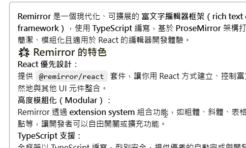

## Rich-text-editor-try

這裡存放前端 **富文本編輯器** 的開發嘗試與使用模板。分別使用不同第三方框架進行功能嘗試。

### Remirror

```bash
# 前往子目錄
cd ./remirror

# 安裝
pnpm install

# 運行並查看
pnpm dev
```

#### MarkdownStyled

擁有 Markdown 語法支持的富文本編輯器嘗試。(樣式沒有補完整)

(1) 選取懸浮選單: 

